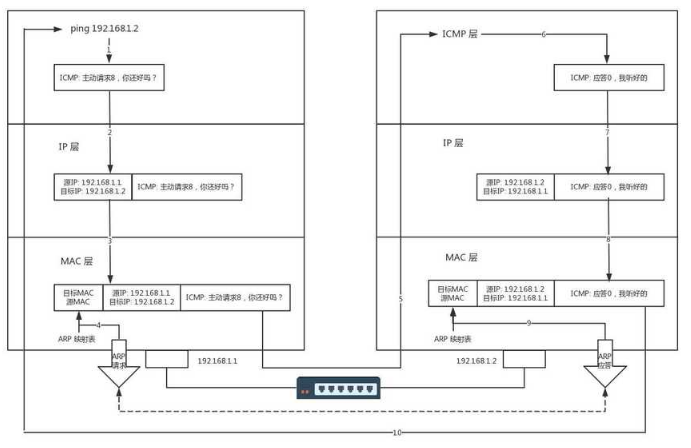

# ICMP

* [ICMP简介](icmp.md#1)
* [ICMP协议](icmp.md#2)
  * [ICMP协议头部](icmp.md#2.1)
  * [ICMP常见的报文类型](icmp.md#2.2)
  * [ICMP In IP](icmp.md#2.3)
  * [常见的ICMP报文](icmp.md#2.4)
* [ICMP典型运用](icmp.md#3)
  * [ping](icmp.md#3.1)
  * [traceroute](icmp.md#3.2)

ICMP简介 ICMP全名为\(INTERNET CONTROL MESSAGE PROTOCOL\)网络控制消息协议.

ICMP产生的背景:  
在网络体系结构的各层次中，都需要控制，而不同的层次有不同的分工和控制内容，任何控制都是建立在信息的基础之上的. IP层的控制功能是最复杂的，主要负责`差错控制、拥塞控制`等。 在基于IP数据报的网络体系中，网关必须自己处理数据报的传输工作，而`IP协议自身没有内在机制来获取差错信息并处理`。为了处理这些错误，TCP/IP设计了ICMP协议，当某个网关发现传输错误时，立即`向信源主机发送ICMP报文`，报告出错信息，让信源主机采取相应处理措施。它是一种差错和控制报文协议，不仅用于传输差错报文，还传输控制报文。

ICMP 所在的网络层级及其作用：  
ICMP属于TCP/IP协议族，工作在网络层（第三层），用于在IP主机、路由器之间传递`控制消息`。所谓的控制消息是指网络通不通、主机是否可达、路由是否可用等网络本身的消息。这些控制消息虽然并不传输用户数据，但是对于用户数据的传递起着重要的作用。ICMP的主要作用是主机探测,路由维护,路由选择,流量控制。  
ICMP协议与ARP协议不同，ICMP靠IP协议来完成任务，所以ICMP报文中要封装IP头部。它与传输层协议（如TCP和UDP）的目的不同，一般不用来在端系统之间传送数据，不被用户网络程序直接使用，除了想Ping和Tracert这样的诊断程序。

ICMP协议

## ICMP协议头部 <a id="2.1"></a>

 ICMP协议封装在IP协议中，ICMP有很多报文类型，每一个报文类型又各自不相同，所以无法找到一个统一的报文格式来进行说明，但是他们的前四个字节的报文格式是相同的。 !\[icmp头部\]\(../pic/icmp/icmp\_head.png\) 类型：一个 8 位类型字段，表示 ICMP 数据包类型; 功能代码：一个 8 位代码域，表示指定类型中的一个功能，如果一个类型中只有一种功能，代码域置为 0; 检验和：数据包中 ICMP 部分上的一个 16 位检验和; \`\`\`

icmp head \`\`\` \`\`\`c /\* \* Struct icmphdr\_common represents the common part of the icmphdr and icmp6hdr \* structures. \*/ struct icmphdr\_common { \_\_u8 type; \_\_u8 code; \_\_sum16 cksum; }; \`\`\`

## ICMP常见的报文类型 <a id="2.2"></a>

ICMP的报文分为两类，一类是ICMP询问报文，一类是ICMP差错报告报文 

## ICMP In IP <a id="2.3"></a>

 ICMP报文包含在IP数据报中，IP报头在ICMP报文的最前面。一个ICMP报文包括IP报头（至少20字节）、ICMP报头（至少八字节）和ICMP报文（属于ICMP报文的数据部分）。当IP报头中的协议字段值为1时，就说明这是一个ICMP报文。ICMP报头如下图所示。 !\[icmp封装\]\(../pic/icmp/icmp\_ip.png\) 各字段说明 类型： 占一字节，标识ICMP报文的类型，目前已定义了14种，从类型值来看ICMP报文可以分为两大类。第一类是取值为1~127的差错报文，第2类是取值128以上的信息报文。 代码： 占一字节，标识对应ICMP报文的代码。它与类型字段一起共同标识了ICMP报文的详细类型。用于标示在特定的功能下不同的错误代码。例如，目标不可达的类型中，标示具体不可达的信息。 校验和： 这是对包括ICMP报文数据部分在内的\`整个ICMP数据报的校验和\`，以检验报文在传输过程中是否出现了差错。其\`计算方法\`与在我们介绍IP报头中的校验和计算方法是一样的。 标识： 占两字节，用于\`标识本ICMP进程\`，但仅适用于\`回显请求和应答ICMP报文\`，对于目标不可达ICMP报文和超时ICMP报文等，该字段的值为0。 \`\`\` /linux/in.h /\* Standard well-defined IP protocols. \*/ enum { IPPROTO\_IP = 0, /\* Dummy protocol for TCP \*/ \#define IPPROTO\_IP IPPROTO\_IP IPPROTO\_ICMP = 1, /\* Internet Control Message Protocol \*/ \#define IPPROTO\_ICMP IPPROTO\_ICMP IPPROTO\_IGMP = 2, /\* Internet Group Management Protocol \*/ \#define IPPROTO\_IGMP IPPROTO\_IGMP IPPROTO\_IPIP = 4, /\* IPIP tunnels \(older KA9Q tunnels use 94\) \*/ \#define IPPROTO\_IPIP IPPROTO\_IPIP IPPROTO\_TCP = 6, /\* Transmission Control Protocol \*/ \#define IPPROTO\_TCP IPPROTO\_TCP IPPROTO\_EGP = 8, /\* Exterior Gateway Protocol \*/ \#define IPPROTO\_EGP IPPROTO\_EGP IPPROTO\_PUP = 12, /\* PUP protocol \*/ \#define IPPROTO\_PUP IPPROTO\_PUP IPPROTO\_UDP = 17, /\* User Datagram Protocol \*/ \`\`\`

## 常见的ICMP报文 <a id="2.4"></a>

1. 相应请求： 我们日常进行的Ping操作中就包括了相应请求（类型字段值为8）和应答（类型字段值为0）ICMP报文。一台主机向一个节点发送一个类型字段值为8的ICMP报文，如果途中没有异常（如果没有被路由丢弃，目标不回应ICMP或者传输失败），则目标返回类型字段值为0的ICMP报文，说明这台主机存在。
2. 目标不可达，源抑制和超时报文： 这三种报文的格式是一样的。目标不可到达报文（类型值为3）在路由器或者主机不能传递数据时使用。例如我们要连接对方一个不存在的系统端口（端口号小于1024）时，将返回类型字段值3、代码字段值为3的ICMP报文。常见的不可到达类型还有网络不可到达（代码字段值为0）、主机不可达到（代码字段值为1）、协议不可到达（代码字段值为2）等等。
3. 源抑制报文（类型字段值为4，代码字段值为0）： 则充当一个控制流量的角色，通知主机减少数据报流量。由于ICMP没有回复传输的报文，所以只要`停止该报文，主机就会逐渐恢复传输速率`。最后，无连接方式网络的问题就是数据报回丢失，或者长时间在网络游荡而找不到目标，或者拥塞导致主机在规定的时间内无法重组数据报分段，这时就要触发ICMP超时报文的产生。
4. 超时报文 （类型字段值为11）的代码域有两种取值：代码字段值为0表示传输超时，代码字段值为1表示分段重组超时。
5. 时间戳请求： 时间戳请求报文（类型值字段13）和时间戳应答报文（类型值字段14）用于测试两台主机之间数据报来回一次的传输时间。传输时，主机填充原始时间戳，接受方收到请求后填充接受时间戳后以类型值字段14的报文格式返回，发送方计算这个时间差。有些系统不响应这种报文。

ICMP典型应用

## ping <a id="3.1"></a>

ICMP的一个典型应用是Ping。Ping是检测网络连通性的常用工具，同时也能够收集其他相关信息。用户可以在Ping命令中指定不同参数，如ICMP报文长度、发送的ICMP报文个数、等待回复响应的超时时间等，设备根据配置的参数来构造并发送ICMP报文，进行Ping测试

 ping命令执行的时候，源主机首先会构建一个ICMP请求数据包，ICMP数据包内包含多个字段。最重要的是两个，第一个是类型字段，对于请求数据包而言该字段为8；另外一个是顺序号，主要用于区分连续ping的时候发出的多个数据包。每发出一个请求数据包，顺序号就会自动加1.为了能够计算往返时间RTT，它会在报文的数据部分插入发送时间。

然后，由ICMP协议将这个数据包连同地址192.168.1.2一起交给IP层，IP层将以192.168.1.2作为目的地址，本机IP地址作为源地址，加上一些其它控制信息，构建一个IP数据包。

接下来，需要加入MAC头。如果在本机ARP映射表中找出IP地址192.168.1.2所对应的MAC地址，则可以直接使用；如果没有，则需要发送ARP协议查询MAC地址，获得MAC地址后，由数据链路层构建一个数据帧，目的地址是IP层传过来的MAC地址，源地址则是本机的MAC地址；还要附加上一些控制信息，依据以太网的介质访问规则，将他们传送出去。

主机B收到这个数据帧后，先检查它的目的MAC地址，并和本机的MAC地址对比，如果符合则接收，否则就丢弃。接收后检查该数据帧，将IP数据包从帧中提取出来，交给本机的IP层。同样IP层检查后，将有用的信息提取后交给ICMP协议。

主机B会构建一个ICMP应答包，应答数据包的类型字段为0，顺序号为接收到的请求数据包中的顺序号，然后再发送出去给主机A。

在规定的时间内，源主机如果没有接到ICMP的应答包，则说明目标主机不可达，如果接收到了ICMP应答包，则说明目标主机可达。

Ping常用的配置参数说明如下：

```text
1. -a source-ip-address指定发送ICMP ECHO-REQUEST报文的源IP地址。如果不指定源IP地址，将采用出接口的IP地址作为ICMP ECHO-REQUEST报文发送的源地址。
2. -c count指定发送ICMP ECHO-REQUEST报文次数。缺省情况下发送5个ICMP ECHO-REQUEST报文。
3. -h ttl-value指定TTL的值。缺省值是255。
4. -t timeout指定发送完ICMP ECHO-REQUEST后，等待ICMP ECHO-REPLY的超时时间。
```

Ping命令的输出信息中包括目的地址、ICMP报文长度、序号、TTL值、以及往返时间。序号是包含在Echo回复消息（Type=0）中的可变参数字段，TTL和往返时间包含在消息的IP头中。

Traceroute ICMP的另一个典型应用是Traceroute。Traceroute基于报文头中的TTL值来逐跳跟踪报文的转发路径。为了跟踪到达某特定目的地址的路径，源端首先将报文的TTL值设置为1。该报文到达第一个节点后，TTL超时，于是`该节点向源端发送TTL超时消息`，消息中携带时间戳。然后源端将报文的TTL值设置为2，报文到达第二个节点后超时，该节点同样返回TTL超时消息，以此类推，直到报文到达目的地。这样，源端根据返回的报文中的信息可以跟踪到报文经过的每一个节点，并根据时间戳信息计算往返时间。 Traceroute是检测网络丢包及时延的有效手段，同时可以帮助管理员发现网络中的路由环路。

Traceroute常用的配置参数说明如下：

```text
1. -a source-ip-address指定Traceroute报文的源地址。
2. -f first-ttl指定初始TTL。缺省值是1。
3. -m max-ttl指定最大TTL。缺省值是30。
4. -name使能显示每一跳的主机名。
5. -p port指定目的主机的UDP端口号。
```

