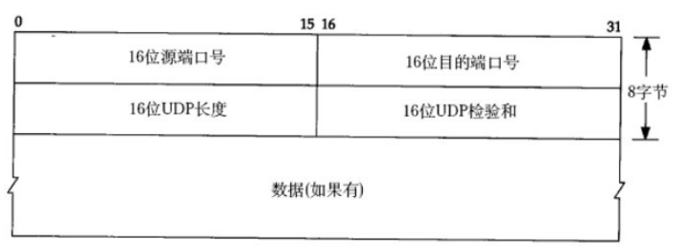
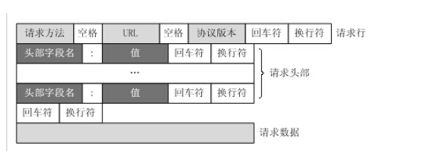

# 数据包格式

* [网络协议栈](tcpip.md#1)
* [以太帧](tcpip.md#2)
* [IP](tcpip.md#3)
* [udp](tcpip.md#4)
* [tcp](tcpip.md#5)
* [http](tcpip.md#6)

  网络协议栈

  协议栈

  因特网协议栈共有五层：

* 应用层，是网络应用程序及其应用层协议存留的地方。因特网的应用层包括许多协议，常见的有HTTP\(它为web文档提供了请求和传送\)、SMTP\(它提供了电子邮件报文的传输\)和FTP\(它提供了两个端系统之间的文件传送\)。
* 传输层，负责为信源和信宿提供应用程序进程（包括同一终端上的不同进程）间的数据传输服务，这一层上主要定义了两个传输协议，传输控制协议即TCP和用户数据报协议UDP。
* 网络层，负责将数据报独立地从信源发送到信宿，主要解决路由选择、拥塞控制和网络互联等问题。
* 链路层，负责将IP数据报封装成合适在物理网络上传输的帧格式并传输，或将从物理网络接收到的帧解封，取出IP数据报交给网络层。
* 物理层，负责将比特流在结点间传输，即负责物理传输。该层的协议既与链路有关也与传输介质有关。

##  以太帧 <a id="2"></a>

###  以太帧数据包格式 <a id="2.1"></a>

 由于物理层更多的是与物理介质有关，所以直接从链路层开始分析。 在链路层中，使用的最多的是以太网，而以太网帧因为历史原因存在多个版本，这里采用IEEE802.3以太网帧格式。 !\[链路层数据包\]\(../pic/proto/eth.png\) \* Preamble 前导码，7个字节，用于数据传输过程中的双方发送、接收的速率的同步 \* SFD：帧开始符，1个字节，表明下一个字节开始是真实数据（目的MAC地址） \* dst MAC：目的MAC地址，6个字节，指明帧的接受者 \* src MAC：源MAC地址，6个字节，指明帧的发送者 \* Length：长度，2个字节，指明该帧\`数据字段的长度\`，但不代表数据字段长度能够达到（2^16）字节 \* Type：类型，2个字节，指明帧中\`数据的协议类型\`，比如常见的IPv4中ip协议采用0x0800 \* Data and Pad：数据与填充，46~1500个字节，包含了上层协议传递下来的数据，如果加入数据字段后帧长度不够64字节，会在数据字段加入“填充”至达到64字节 \* FCS：帧校验序列，4个字节，对接收网卡（主要是检测Data and Pad字段）提供判断是否传输错误的一种方法，如果发现错误，丢弃此帧。 目前最为流行的用于FCS的算法是循环冗余校验（cyclic redundancy check –CRC）

###  以太帧内核实现 <a id="2.2"></a>

####  以太帧头部 <a id="2.2.1"></a>

在linux系统中，使用struct ethhdr结构体来表示以太网帧的头部。这个struct ethhdr结构体位于`#include<linux/if_ether.h>`之中。

```c
#define ETH_ALEN 6  //定义了以太网接口的MAC地址的长度为6个字节
#define ETH_HLAN 14  //定义了以太网帧的头长度为14个字节
#define ETH_ZLEN 60  //定义了以太网帧的最小长度为 ETH_ZLEN + ETH_FCS_LEN = 64个字节
#define ETH_DATA_LEN 1500  //定义了以太网帧的最大负载为1500个字节
#define ETH_FRAME_LEN 1514  //定义了以太网正的最大长度为ETH_DATA_LEN + ETH_FCS_LEN = 1518个字节
#define ETH_FCS_LEN 4   //定义了以太网帧的CRC值占4个字节

struct ethhdr
{
    unsigned char h_dest[ETH_ALEN]; //目的MAC地址
    unsigned char h_source[ETH_ALEN]; //源MAC地址
    __u16 h_proto ; //网络层所使用的协议类型
}__attribute__((packed))  //用于告诉编译器不要对这个结构体中的缝隙部分进行填充操作；
```

网络层所使用的协议类型有\(常见的类型\)：

```text
#define  ETH_P_IP 0x0800 //IP协议
#define  ETH_P_ARP 0x0806  //地址解析协议(Address Resolution Protocol)
#define  ETH_P_RARP 0x8035  //返向地址解析协议(Reverse Address Resolution Protocol)
#define  ETH_P_IPV6 0x86DD  //IPV6协议
static inline struct ethhdr *eth_hdr(const struct sk_buff *skb)
{
     return (struct ethhdr *)skb_mac_header(skb);
}
//MAC地址的输出格式。 "%02x"所表示的意思是：以16进制的形式输出，每一个16进制字符占一个字节
#define MAC_FMT  "%02x:%02x:%02x:%02x:%02x:%02x" 
#define MAC_BUF_LEN 18 //定义了用于存放MAC字符的缓存的大小
#define DECLARE_MAC_BUF(var)  char var[MAC_BUF_LEN] //定义了一个MAC字符缓存
```

####  填充以太网头部struct ethhdr: <a id="2.2.2"></a>

 \`\`\` int eth\_header\(struct sk\_buff \*skb, struct net\_device \*dev, u16 type, void \*daddr, void \*saddr, unsigned len\) EXPORT\_SYMBOL\(eth\_header\); \`\`\` \* skb : 将要去修改的struct sk\_buff； \* dev : 原网络设备 \* type: 网络层的协议类型 \* daddr:目的MAC地址 \* saddr:源MAC地址 \* len :一般可为0 \`\`\` int eth\_header\(struct sk\_buff \*skb, struct net\_device \*dev, u16 type, void \*daddr, void \*saddr, int len\) { //将skb-&gt;data = skb-&gt;data + ETH\_ALEN; struct ethhdr \*eth = \(struct ethhdr\*\)skb\_push\(skb, ETH\_ALEN\); if\(type != ETH\_P\_802\_3\) eth-&gt;proto = htons\(type\); // htons\(\)将本地类型转换为网络类型 else eth-&gt;proto = htons\(len\); //如果 saddr = NULL的话，以太网帧头中的源MAC地址为dev的MAC地址 if\(!saddr\) saddr = dev-&gt;dev\_addr; memcpy\(eth-&gt;saddr, saddr, ETH\_ALEN\); if\(daddr\) { memcpy\(eth-&gt;daddr, daddr, ETH\_ALEN\); return ETH\_HLEN ; //返回值为14 } return -ETH\_HLEN; } \`\`\`

####  判断网络层协议 <a id="2.2.3"></a>

 \`\`\` \_\_be16 eth\_type\_trans\(struct sk\_buff \*skb, struct net\_device \*dev\); EXPORT\_SYMBOL\(eth\_type\_trans\); \`\`\` \* skb : 为正在接收的数据包； \* dev : 为正在使用的网络设备； \* 返回值：为网络字节序列，所以要使用ntohs\(\)进行转换； \`\`\` \_\_be16 eth\_type\_trans\(struct sk\_buff \*skb, struct net\_device \*dev\) { struct ethhdr \*eth; skb-&gt;dev = dev; eth = eth\_hdr\(skb\); if\(netdev\_uses\_dsa\_tags\(dev\)\) return htons\(ETH\_P\_DSA\); if\(netdev\_uses\_trailer\_tags\(dev\)\) return htons\(ETH\_P\_TRAILER\); if\( ntohs\(eth-&gt;h\_proto\) &gt;= 1536 \) return eth-&gt;h\_proto; } \`\`\`

####  提取mac地址 <a id="2.2.4"></a>

 \`\`\` int eth\_header\_parse\(struct sk\_buff \*skb, u8 \*haddr\) EXPORT\_SYMBOL\(eth\_header\_parse\); \`\`\` \* skb : 接收到的数据包； \* haddr : 用于存放从接收的数据包中提取的硬件地址； \`\`\` int eth\_header\_parse\(struct sk\_buff \*skb, u8 \*haddr\) { struct ethhdr \*eth = eth\_hdr\(skb\); memcpy\(haddr, eth-&gt;h\_source, ETH\_ALEN\); //可知haddr中存放的是源MAC地址； return ETH\_ALEN; } \`\`\`

####  mac地址转换 <a id="2.2.5"></a>

在struct ethhdr中MAC地址为6个字节，并不是我们常见的MAC字符串地址，那么如果将6字节的MAC地址转化为我们常见的MAC字符串地址，使用下面这个函数：

```text
char *print_mac(char *buffer, const unsigned char *addr);
EXPORT_SYMBOL(print_mac);
```

* buffer : 为MAC字符串地址存放的地方；
* addr   : 为6字节MAC地址；

  ```text
  char *print_mac(char *buffer, const unsigned char *addr)
  {
   // MAC_BUF_SIZE = 18
   // ETH_ALEN = 6
   _format_mac_addr(buffer, MAC_BUF_SIZE, addr, ETH_ALEN);
   return buffer;
  }
  ```

####  重新设置一个网络设备的MAC地址： <a id="2.2.6"></a>

 \`\`\` int eth\_mac\_addr\(struct net\_device \*dev, void \*p\); EXPORT\_SYMBOL\(eth\_mac\_addr\); \`\`\` \* dev : 为将要被设置的网络设备； \* p : 为socket address; \`\`\` int eth\_mac\_addr\(struct net\_device \*dev, void \*p\) { struct sockaddr \*addr = p; //用于判断网络设备是否正在运行 if\(netif\_running\(dev\)\) return -EBUSY; if\( !is\_valid\_ether\_addr\(addr-&gt;sa\_data\) \) return -ETHADDRNOTAVAIL; memcpy\(dev-&gt;dev\_addr, addr-&gt;sa\_data, ETH\_ALEN\); return 0; } \`\`\`

####  struct net\_device以太网网络设备进行初始化： <a id="2.2.7"></a>

```text
void ether_setup(struct net_device *dev);
EXPORT_SYMBOL(ether_setup);
```

####  分配一个以太网网络设备，并对其进行初始化： <a id="2.2.8"></a>

 \`\`\` struct net\_device \*alloc\_etherdev\_mq\(int sizeof\_priv, u32 queue\_count\) EXPORT\_SYMBOL\(alloc\_etherdev\_mq\); \`\`\` \`\`\` struct net\_device \*alloc\_etherdev\_mq\(int sizeof\_priv, unsigned int queue\_count\) { // ether\_setup为对分配的struct net\_device进行初始化的函数； //这个ether\_setup是内核的导出函数，可以直接使用； return alloc\_netdev\_mq\(sizeof\_priv, "eth%d", ether\_setup, queue\_count\); } \#define alloc\_etherdev\(sizeof\_priv\) alloc\_etherdev\_mq\(sizeof\_priv, 1\) \`\`\`

###  MAC地址相关函数 <a id="2.3"></a>

 下面的这些函数用于struct ethhdr中的MAC地址的判断：

####  用于判断一个MAC地址是否为零； <a id="2.3.1"></a>

 \`\`\` 1.int is\_zero\_ether\_addr\(const u8 \*addr\); static inline int is\_zero\_ether\_addr\(const u8 \*addr\) { return !\(addr\[0\] \| addr\[1\] \| addr\[2\] \| addr\[3\] \| addr\[4\] \| addr\[5\]\); } \`\`\`

####  用于判断addr中的MAC地址是否是组播MAC地址； <a id="2.3.2"></a>

 \`\`\` 2.int is\_multicast\_ether\_addr\(const u8 \*addr\) static inline int is\_multicast\_ether\_addr\(const u8 \*addr\) { //组播MAC地址的判断方法：如果一个MAC地址的最低一位是1的话，则这个MAC地址为组播MAC地址； return \(0x01 & addr\[0\]\); } \`\`\`

####  用于判断addr中的MAC地址是否是广播地址； <a id="2.3.3"></a>

 \`\`\` 3.int is\_broadcast\_ether\_addr\(const u8 \*addr\) static inline int is\_broadcast\_ether\_addr\(const u8 \*addr\) { return \( addr\[0\] & addr\[1\] & addr\[2\] & addr\[3\] & addr\[4\] & addr\[5\] \) == 0xff; } \`\`\`

####  用于判断addr中的MAC地址是否是有效的MAC地址； <a id="2.3.4"></a>

```text
4. int is_valid_ether_addr(const u8* addr)
static inline int is_valid_ether_addr(const u8 *addr)
{
   //既不是组播地址，也不为0的MAC地址为有效的MAC地址；
   return !is_multicast_ether_addr(addr) && !is_zero_ether_addr(addr);
}
```

 用于软件随机产生一个MAC地址，然后存放与addr之中；

```text
5. void random_ether_addr(u8 *addr)
static inline void random_ether_addr(u8 *addr)
{
     get_random_bytes(addr, ETH_ALEN);
     addr[0] & = 0xfe;
     addr[0] |= 0x02; // IEEE802本地MAC地址
}
```

 判断addr中MAC地址是否是IEEE802中的本地MAC地址。

```text
6.int is_local_ether_addr(const u8 *addr)
static inline int is_local_ether_addr(const u8 *addr)
{
    return (0x02 & addr[0]);
}
```

关于IEEE802 MAC地址的须知：

IEEE802 LAN6字节MAC地址是目前广泛使用的LAN物理地址。IEEE802规定LAN地址字段的第一个字节的最低位表示I/G（Individual /Group）比特，即单地址/组地址比特。当它为“0”时，表示它代表一个单播地址，而这个位是“1”时，表示它代表一个组地址。 IEEE802规定LAN地址字段的第一个字节的最低第二位表示G/L（Globe/Local）比特，即全球/本地比特。当这个比特为“0”时，表 示全球管理，物理地址是由全球局域网地址的法定管理机构统一管理，全球管理地址在全球范围内不会发生地址冲突。当这个比特为“1”时，就是本地管理，局域 网管理员可以任意分配局部管理的网络上的地址，只要在自己网络中地址唯一不产生冲突即可，对外则没有意义，局部管理很少使用。 在6个字节的其他46个比特用来标识一个特定的MAC地址，46位的地址空间可表示约70万亿个地址，可以保证全球地址的唯一性。

 用于比较两个MAC地址是否相等，相等返回0，不相等返回1；

```text
7.unsigned compare_ether_addr(const u8 *addr1, const u8 *addr2)

static inline unsigned compare_ether_addr(const u8 *addr1, const u8 *addr2)
{
    const u16 *a = (const u16*)addr1;
    const u16 *b = (const u16*)addr2;

    return ( (a[0] ^ b[0]) | (a[1] ^ b[1]) | (a[2] ^ b[2]) ) != 0;
}
```

以上的所有的函数可以通过 \#include&lt;linux/etherdevice.h&gt;头文件，来直接使用。

##  IP 吐量、最高可靠性和最小费用。这4比特的服务类型中只能置其中1比特为1。可以全为0，若全为0则表示一般服务。大多数情况下该TOS会被忽略 Total Length：总长度，16位，指明整个数据报的长度，按字节为计算。最大长度为65535（2^16=65536）字节 Identification：标识，16位，用来唯一地标识主机发送的每一份数据报。IP软件会在\`存储器中维持一个计数器\`，每产生一个数据段，计数器就加1，并将此值赋给标识字段。但这个“标识”并不是序号，因为IP是无连接服务，数据报不存在按序接收的问题。\`如数据报由于超过网络的MTU而必须分片时\`，这个标识字段的值就被复制到所有的数据报的标识字段中。相同的标识字段的值使\`分片后各数据报片最后能正确的重装\`成为原来的数据报 Flags：标志，3位，分别是（RF, DF, MF），目前只有DF, MF有效。 \* DF（don't fragment），置为0时表示可以分段，置为1是不能被分段； \* MF（more fragment），置为0时表示该数据段为最后一个数据段，置为1时表示后面还有被分割分段 Fragment offset：段偏移量，13位，指出较长的分组在分段后，某段在原分组的相对位置。 也就是说相对用户字段的起点，该片从何处开始。 段偏移以8个字节（有3位被flags占据）为偏移单位。这就是，每个分片的长度一定是8字节（64位）的整数倍 Time to live：生存期（TTL），8位，用来设置数据报最多可以经过的路由器数。由发送数据的源主机设置，通常为32、64、128等。每经过一个路由器，其值减1，直到0时该数据报被丢弃 Protcol：协议，8位，ip数据字段中的数据采用上层什么协议封装的。常见的有ICMP（1）、IGMP（2）、TCP（6）、UDP（17） Header Checksum：头部校验和，16位，填充根据IP头部计算得到的校验和码。计算方法是：对头部中每个16比特进行二进制反码求和，但不和涉及头部后的数据字段 Source Address：源ip地址，32位，如（192.168.1.2） Destination Address：目的ip地址，32位，如（192.168.1.3） Option：选项，n\*32位。用来定义一些可选项：如记录路径、时间戳等。但这些选项很少被使用，同时并不是所有主机和路由器都支持这些选项。可选项字段的长度必须是32比特的整数倍，如果不足，必须填充0以达到此长度要求。根据IHL可以得到option的长度 Data：数据，不定长度，但受限于数据报的最大长度（65535）。这是在数据报中要传输的数据。它是一个完整的较高层报文或报文的一个分片 <a id="3"></a>

 吐量、最高可靠性和最小费用。这4比特的服务类型中只能置其中1比特为1。可以全为0，若全为0则表示一般服务。大多数情况下该TOS会被忽略 Total Length：总长度，16位，指明整个数据报的长度，按字节为计算。最大长度为65535（2^16=65536）字节 Identification：标识，16位，用来唯一地标识主机发送的每一份数据报。IP软件会在\`存储器中维持一个计数器\`，每产生一个数据段，计数器就加1，并将此值赋给标识字段。但这个“标识”并不是序号，因为IP是无连接服务，数据报不存在按序接收的问题。\`如数据报由于超过网络的MTU而必须分片时\`，这个标识字段的值就被复制到所有的数据报的标识字段中。相同的标识字段的值使\`分片后各数据报片最后能正确的重装\`成为原来的数据报 Flags：标志，3位，分别是（RF, DF, MF），目前只有DF, MF有效。 \* DF（don't fragment），置为0时表示可以分段，置为1是不能被分段； \* MF（more fragment），置为0时表示该数据段为最后一个数据段，置为1时表示后面还有被分割分段 Fragment offset：段偏移量，13位，指出较长的分组在分段后，某段在原分组的相对位置。 也就是说相对用户字段的起点，该片从何处开始。 段偏移以8个字节（有3位被flags占据）为偏移单位。这就是，每个分片的长度一定是8字节（64位）的整数倍 Time to live：生存期（TTL），8位，用来设置数据报最多可以经过的路由器数。由发送数据的源主机设置，通常为32、64、128等。每经过一个路由器，其值减1，直到0时该数据报被丢弃 Protcol：协议，8位，指明ip数据字段中的数据采用上层什么协议封装的。常见的有ICMP（1）、IGMP（2）、TCP（6）、UDP（17） Header Checksum：头部校验和，16位，填充根据IP头部计算得到的校验和码。计算方法是：对头部中每个16比特进行二进制反码求和，但不和涉及头部后的数据字段 Source Address：源ip地址，32位，如（192.168.1.2） Destination Address：目的ip地址，32位，如（192.168.1.3） Option：选项，n\*32位。用来定义一些可选项：如记录路径、时间戳等。但这些选项很少被使用，同时并不是所有主机和路由器都支持这些选项。可选项字段的长度必须是32比特的整数倍，如果不足，必须填充0以达到此长度要求。根据IHL可以得到option的长度 Data：数据，不定长度，但受限于数据报的最大长度（65535）。这是在数据报中要传输的数据。它是一个完整的较高层报文或报文的一个分片

##  udp <a id="4"></a>

udp/tcp帧

 UDP协议全称是用户数据报协议（User Datagram Protocol） ，在网络中它与TCP协议一样用于处理数据包，是一种无连接的协议。在OSI模型中，在第四层——传输层，处于IP协议的上一层。由于udp传输不是可靠性服务的，所以帧结构较为简单，而且处理，发送速率高，所以经常被用作音频、视频和普通数据的传输协议，因为它们即使偶尔丢失一两个数据包，也不会对接收结果产生太大影响。

src port：源端口，2个字节，是一个大于1023的16位数字，由基于UDP应用程序的用户进程随机选择。

dst port：目的端口，2个字节，指明接收者所用的端口号，一般由应用程序来指定

Length：数据长度，2个字节，指明了包括首部在内的UDP报文段长度

Checksum：检验和，2个字节，指整个UDP报文头和UDP所带的数据的校验和（也包括伪报文头）。伪报文头不包括在真正的UDP报文头中，但是它可以保证UDP数据被正确的主机收到了

Data：数据字段，不定长度，为上层协议封装好的数据

##  TCP <a id="5"></a>

 TCP（Transmission Control Protocol 传输控制协议）是一种面向连接的、可靠的、基于字节流的传输层通信协议。当应用层向TCP层发送用于网间传输的、用8位字节表示的数据流，TCP则把数据流分割成适当长度的报文段，最大传输段大小（MSS）通常受该计算机连接的网络的数据链路层的最大传送单元（MTU）限制。之后TCP把数据包传给IP层，由它来通过网络将包传送给接收端实体的TCP层。 !\[tcp数据包格式\]\(../pic/proto/tcp.png\) src port：源端口，2个字节，是一个大于1023的16位数字，由基于TCP应用程序的用户进程随机选择 dst port：目的端口，2个字节，指明接收者所用的端口号，一般由应用程序来指定 Sequence number：顺序号，4个字节，用来标识从 TCP 源端向 TCP 目的端发送的数据字节流，它表示在这个报文段中的第一个数据字节的顺序号。如果将字节流看作在两个应用程序间的单向流动，则 TCP 用顺序号对每个字节进行计数。序号是 32bit 的无符号数，序号到达 \(2^32\) － 1 后又从 0 开始。当建立一个新的连接时， SYN 标志变 1 ，顺序号字段包含由这个主机选择的该连接的初始顺序号 ISN （ Initial Sequence Number ） Acknowledgement number：确认号，4个字节，包含发送确认的一端所期望收到的下一个顺序号。因此，确认序号应当是上次已成功收到数据字节顺序号加 1 。只有 ACK 标志为 1 时确认序号字段才有效 Offset：报头长度，4位，给出报头中 32bit 字的数目。需要这个值是因为任选字段的长度是可变的。这个字段占 4bit ， 即TCP 最多有 60（15\*4） 字节的首部 Resrvd：保留区域，6位，保留给将来使用，目前必须置为 0 Control Flags（6位）控制位包括 URG：为 1 表示紧急指针有效，为 0 则忽略紧急指针值 ACK：为 1 表示确认号有效，为 0 表示报文中不包含确认信息，忽略确认号字段 PSH：为 1 表示是带有 PUSH 标志的数据，指示接收方应该尽快将这个报文段交给应用层而不用等待缓冲区装满 RST：用于复位由于主机崩溃或其他原因而出现错误的连接。它还可以用于拒绝非法的报文段和拒绝连接请求。一般情况下，如果收到一个 RST 为 1 的报文，那么一定发生了某些问题 SYN：同步序号，为 1 表示连接请求，用于建立连接和使顺序号同步（ synchronize ） FIN：用于释放连接，为 1 表示发送方已经没有数据发送了，即关闭本方数据流 Window Size：窗口大小，2个字节，表示从确认号开始，本报文的源方可以接收的字节数，即源方接收窗口大小。窗口大小是一个 16bit 字段，因而窗口大小最大为 65535（2^16 - 1） Checksum：校验和，2个字节，对整个的 TCP 报文段（包括 TCP 头部和 TCP 数据），以 16 位字进行计算所得。这是一个强制性的字段，要求由发送端计算和存储，并由接收端进行验证 Urgent Pointer：紧急指针，2个字节，是一个正的偏移量，和顺序号字段中的值相加表示紧急数据最后一个字节的序号。 TCP 的紧急方式是发送端向另一端发送紧急数据的一种方式。 只有当URG 标志置 1 时紧急指针才有效 Option and Pad：选项和填充，n\*4字节，常见的可选字段是最长报文大小 MSS\(Maximum Segment Size\) 。每个连接方通常都在通信的第一个报文段（为建立连接而设置 SYN 标志的那个段）中指明这个选项，它指明本端所能接收的最大长度的报文段。选项长度不一定是 32 位字的整数倍，所以要加填充位，使得报头长度成为整字数 Data：数据，不定长度，为上层协议封装好的数据 附三次握手（建立连接），四次挥手（释放连接） 握手： 1.客户端发送一个 SYN 报文段（ SYN 为 1 ）指明客户端打算连接的服务器的端口，以及初始顺序号（ ISN ） （客户端----》服务端） 2.服务器发回包含服务器的初始顺序号（ ISN ）的 SYN 报文段（ SYN 为 1 ）作为应答。同时，将确认号设置为客户的 ISN 加 1 以对客户的 SYN 报文段进行确认（ ACK 也为 1 ）（服务端----》客户端） 3.客户端必须将确认号设置为服务器的 ISN 加 1 以对服务器的 SYN 报文段进行确认（ ACK 为 1 ），该报文通知目的主机双方已完成连接建立（客户端----》服务端） 挥手： 1.客户端发送一个FIN（FIN为1），用来关闭客户端到服务器的数据传送 （客户端----》服务端） 2.服务器收到这个FIN，它发回一个ACK（ACK为1），确认序号为收到的序号加1 （服务端----》客户端） 3.服务器关闭与客户端的连接，发送一个FIN给客户端 （服务端----》客户端） 4.客户端发回ACK报文确认，并将确认序号设置为收到序号加1 （客户端----》服务端） 四次挥手的目的在于如果客户端因为数据发送完毕而想要关闭，便发送FIN。服务端收到FIN后，但可能还存在数据需要发给客户端，所以服务端先发ACK作为应答。当服务端也发送完毕之后，再发回FIN作为关闭连接。客户端收到FIN后，发送ACK，然后关闭连接。

##  http <a id="6"></a>

http报文 http属于应用层协议，自由度更高，是面向文本的，报文中的每一个字段都是一些ASCII码串，各个字段的长度是不确定的。报文类型可以分为两种：请求报文和响应报文

http请求报文：



写成段式的话是：

1.请求行

请求行包括了请求方法、URL、协议版本，它们之间用空格分隔，且都不定长度，所以我们输入的URL是不允许带有空格的。

请求方法：常用的POST（将表单数据存入请求体里面，多数用于上传数据）, GET（将请求参数都放置在URL+?后，参数之间用&连接，用于获取数据）, HEAD（服务端只返回响应头，所以处理响应速度快，用于检测请求是否可用）。

2.请求头

每一行以键/值的形式写入，键值间用:分割，多个值之间以;分割，每行以回车符换行符为结束。常见的键有：User-Agent：产生请求的浏览器类型；Accept：客户端可识别的内容类型列表；Host：请求的主机名，允许多个域名同处一个IP地址；Range：指定请求实体的一个或者多个子范围，采用多线程下载时可以设置该键。要注意请求头与请求体间的一个空行，它表示通知服务端没有更多请求头了，下面的都是请求体。

3.请求体

请求数据不在GET方法中使用，而是在POST方法中使用。POST方法适用于需要客户填写表单的场合。

http响应报文： 

写成段式：

1.状态行

状态包括协议版本，状态码，状态码描述，常见的一个状态行的例子是（ HTTP/1.1 200 OK ），200表示请求正常，更多的状态码可以查有关资料。

2.响应头

与请求头类似，通过键/值的形式向客户端传递关键消息，常见的有：Content-Type：用于向接收方指示实体的介质类型；Content-Range：用于向接收方指示实体的传送范围；Content-Length：用于向接收方指示实体的传送长度；Date：传送时系统的日期与时间。

3.响应体

服务端真正返回的文本数据，如果客户端请求一个网页的话，该数据段将填充请求的html文本。给一个响应头的例子：

\[html\] view plain copy

HTTP/1.1 200 OK  
Date: Thu, 28 Apr 2016 23:59:59 GMT  
Content-Type: text/html;charset=ISO-8859-1  
Content-Length: 122

＜html＞  
＜head＞  
＜title＞Test＜/title＞  
＜/head＞  
＜body＞

hello  
＜/body＞  
＜/html＞

总结 如果分析一个http请求的话，按照因特网五层协议，得到的数据流将是这样的：

